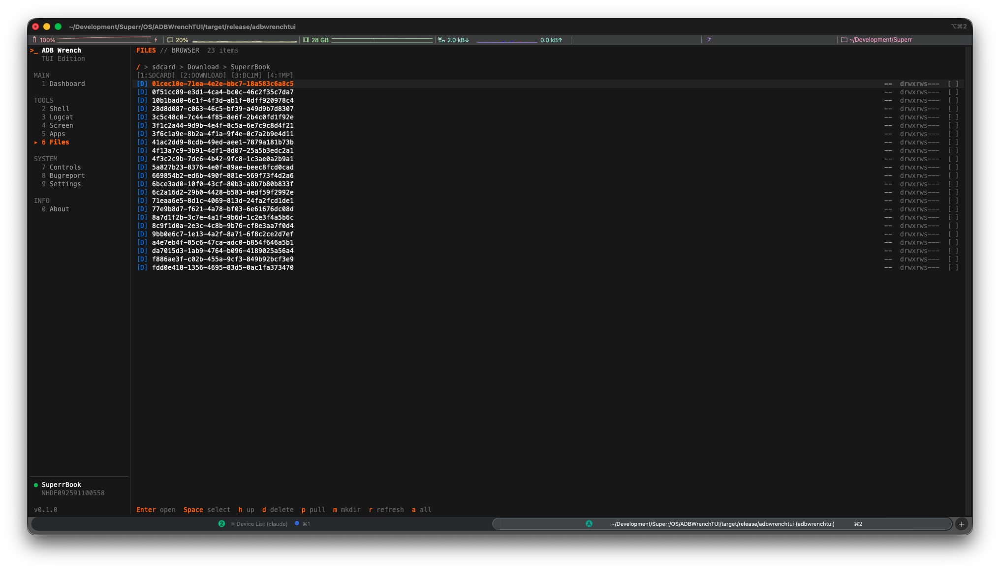
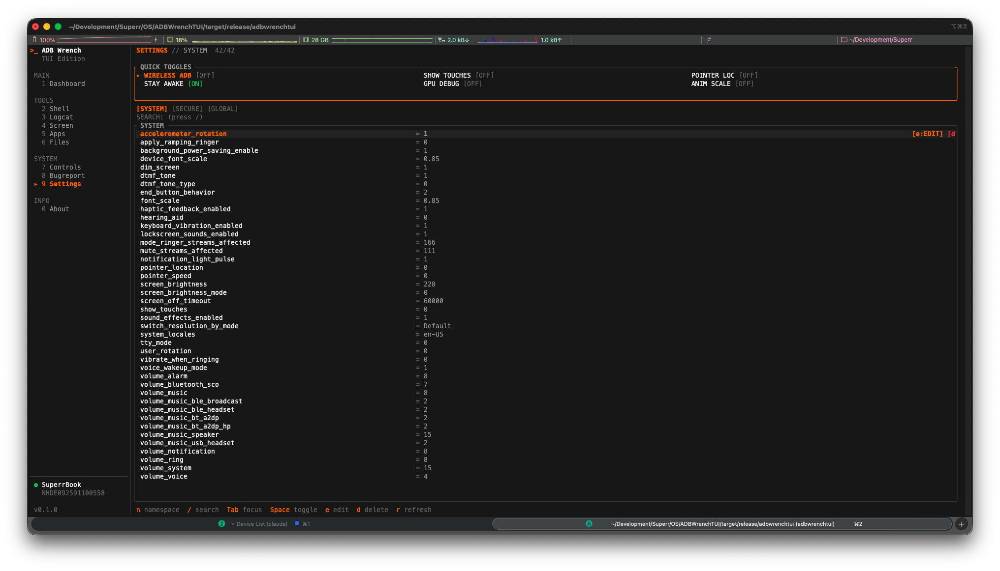
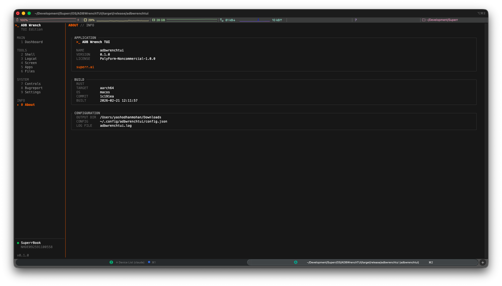

<div align="center">
  <h1>ADBWrenchTUI</h1>
  <p><strong>Terminal-first Android debugging over ADB.</strong></p>
  <p>
    <a href="https://github.com/SuperrAI/ADBWrenchTUI/releases"></a>
    <a href="https://www.rust-lang.org/"></a>
    <a href="https://polyformproject.org/licenses/noncommercial/1.0.0/"></a>
  </p>
</div>

ADBWrenchTUI is a high-velocity command center for Android diagnostics and device operations. It is the terminal counterpart of [ADB Wrench](https://adbwrench.com/) by [Superr](https://superr.ai).

<p align="center">
  
</p>

## Why ADBWrenchTUI

- Fast, keyboard-driven workflows for common Android debugging tasks
- Unified place for shell, logcat, files, apps, bugreports, and system controls
- Real-time views with filters and focused navigation for high-noise debugging sessions

## Feature Set

| Page | What you can do |
|---|---|
| **Dashboard** | Device overview, battery, memory, storage, process list |
| **Shell** | Interactive ADB shell, history, streaming output |
| **Logcat** | Live logs with level/tag/search filters and scroll controls |
| **Screen** | Screenshot capture with preview, timed recording |
| **Apps** | Browse/search packages, open/stop/clear/uninstall apps |
| **Files** | Browse device files, pull/delete/create directories |
| **Controls** | Reboot modes, brightness/volume, key/input actions |
| **Bugreport** | Generate, track, and download bugreports |
| **Settings** | View/edit `system`, `secure`, and `global` settings |

## Screenshot Gallery

<table>
  <tr>
    <td align="center">
      
      <br><sub><b>Files</b></sub>
    </td>
    <td align="center">
      
      <br><sub><b>Settings</b></sub>
    </td>
  </tr>
  <tr>
    <td align="center" colspan="2">
      
      <br><sub><b>About</b></sub>
    </td>
  </tr>
</table>

## Prerequisites

- [ADB](https://developer.android.com/tools/adb) installed and available on `PATH`
- Android device with USB debugging enabled

## Quick Start

### Option 1: Download a release

Download the latest binary from [Releases](https://github.com/SuperrAI/ADBWrenchTUI/releases).

```bash
chmod +x adbwrenchtui-*
./adbwrenchtui-<platform>
```

Optional checksum verification:

```bash
sha256sum -c checksums-sha256.txt
```

### Option 2: Build from source

Requires [Rust](https://rustup.rs/) (stable toolchain).

```bash
git clone https://github.com/SuperrAI/ADBWrenchTUI.git
cd ADBWrenchTUI
cargo build --release
./target/release/adbwrenchtui
```

## Core Keybindings

| Key | Action |
|---|---|
| `1`-`9`, `0` | Jump pages from sidebar |
| `j` / `k` | Navigate up/down |
| `Tab` | Toggle sidebar/content focus |
| `Enter` | Select / confirm |
| `Esc` | Return to sidebar |
| `Ctrl+C` / `q` | Quit |

Every page also shows contextual shortcuts in the footer.

## Configuration

Configuration file:

```text
~/.config/adbwrenchtui/config.json
```

Example:

```json
{
  "output_dir": "/path/to/save/captures"
}
```

- `output_dir`: destination for screenshots, recordings, and bugreports
- You can update output path from the Screen page using `p`

## Debug Logging

Runtime logs are written to:

```text
adbwrenchtui.log
```

Tail logs:

```bash
tail -f adbwrenchtui.log
```

## License

[PolyForm Noncommercial 1.0.0](https://polyformproject.org/licenses/noncommercial/1.0.0/)

## Project Links

- [ADB Wrench (Web)](https://adbwrench.com/)
- [Superr](https://superr.ai)
